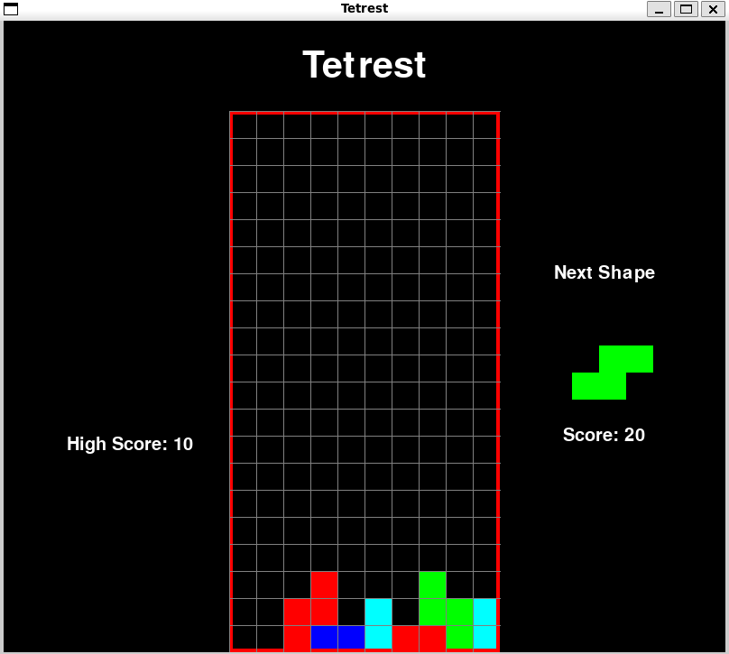

# Tetrest



Tetrest is a Tetris clone implemented in Python using the Pygame library. This project demonstrates the basic mechanics of the classic Tetris game, including piece generation, rotation, line clearing, and score tracking.

## Features

- **Classic Tetris Gameplay**: Includes the seven standard Tetris shapes (S, Z, I, O, J, L, T).
- **Piece Rotation**: Pieces can be rotated to fit into the grid.
- **Line Clearing**: Complete lines are cleared from the grid, and the score is updated.
- **Score Tracking**: Keeps track of the current score and the high score.
- **Next Piece Preview**: Displays the next piece to appear in the game.

## Requirements

- Python 3.x
- Pygame

## Installation

1. Clone the repository:
    ```sh
    git clone https://github.com/jafestro/tetrest.git
    ```
2. Navigate to the project directory:
    ```sh
    cd tetrest
    ```
3. Install the required dependencies:
    ```sh
    pip install -r requirements.txt
    ```

## Usage

Run the game by executing the `tetrest.py` file:
```sh
python tetrest.py
```

## Controls

- **Left Arrow**: Move piece left
- **Right Arrow**: Move piece right
- **Down Arrow**: Move piece down
- **Up Arrow**: Rotate piece

## Code Overview

- **Piece Class**: Represents a Tetris piece with its position, shape, color, and rotation.
- **create_grid**: Initializes the game grid.
- **convert_shape_format**: Converts the shape format to grid positions.
- **valid_space**: Checks if the current piece position is valid.
- **check_lost**: Checks if the game is lost.
- **get_shape**: Generates a new random piece.
- **draw_text_middle**: Draws text in the middle of the screen.
- **draw_grid**: Draws the grid lines.
- **clear_rows**: Clears completed rows and updates the locked positions.
- **draw_next_shape**: Displays the next piece.
- **update_score**: Updates the high score.
- **max_score**: Retrieves the high score.
- **draw_window**: Draws the game window.
- **main**: Main game loop.
- **main_menu**: Displays the main menu.

## License

This project is licensed under the MIT License. See the [LICENSE](LICENSE) file for details.

## Acknowledgements

- Pygame library for game development.
- Tetris game concept.

Enjoy playing Tetrest!